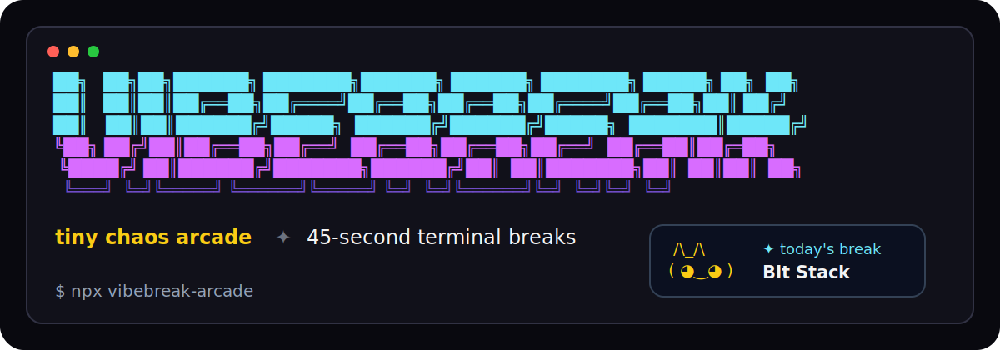
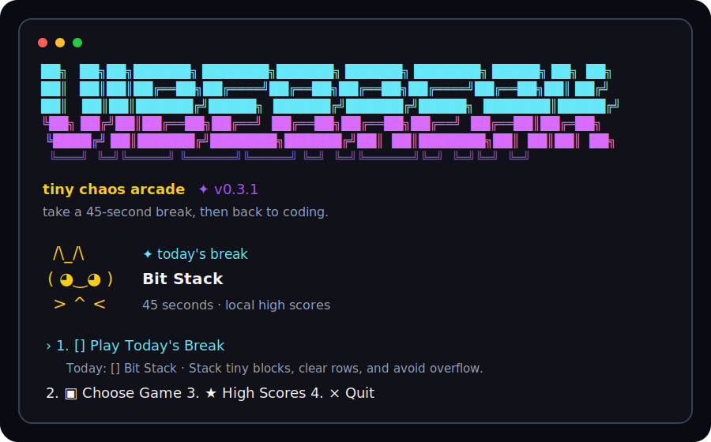
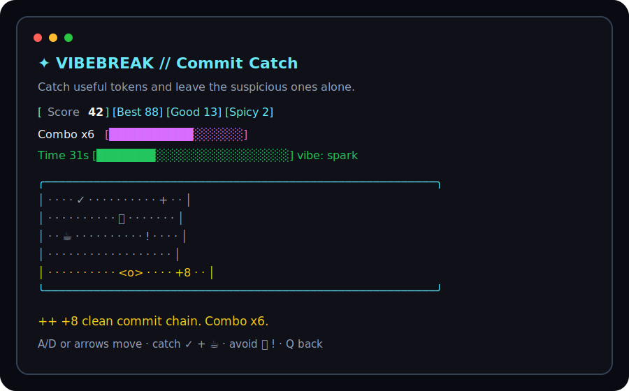

# Vibebreak

<p align="center">
  
</p>

<p align="center">
  <a href="https://www.npmjs.com/package/vibebreak-arcade"></a>
  <a href="https://github.com/tacotuesday8888/vibebreak/actions/workflows/ci.yml"></a>
  <a href="LICENSE"></a>
  
</p>

Vibebreak is a chaotic-cozy terminal break arcade built with Node.js, TypeScript, Ink, and React. It gives you short 45-second mini-games for tiny brain resets, with local high scores and no backend, login, cloud service, AI, payments, analytics, or telemetry.

The npm package is [`vibebreak-arcade`](https://www.npmjs.com/package/vibebreak-arcade). The unscoped `vibebreak` package name is already taken by an unrelated project.

## Preview

<p align="center">
  
  
</p>

## Quick Start

Run without installing:

```bash
npx --yes vibebreak-arcade@latest
```

Jump straight into Today's Break:

```bash
npx --yes vibebreak-arcade@latest daily
```

Make a command wait more fun:

```bash
npx --yes vibebreak-arcade@latest wait -- npm test
```

Vibebreak requires Node.js 22 or newer because it uses Ink 7.

## Install

Install globally if you want the command available everywhere:

```bash
npm install --global vibebreak-arcade
```

Then run:

```bash
vibebreak-arcade
vibebreak-arcade daily
vibebreak-arcade play snake-bytes
vibebreak-arcade wait -- npm test
vibebreak-arcade scores
```

Prefer a shorter command? Add an alias to your shell config:

```bash
alias vibebreak='vibebreak-arcade'
```

## Games

Each round is short, keyboard-simple, and built for quick replay.

| Game | ID | Objective |
| --- | --- | --- |
| Dodge the Bugs | `dodge` | Dodge falling bugs and collect near-miss style points. |
| Commit Catch | `commit-catch` | Catch `✓`, `+`, and `☕`; avoid `🐛` and `!`. |
| Stack Trace Sprint | `stack-sprint` | Grab `FIX` tokens and sidestep noisy `ERR` blocks. |
| Snake Bytes | `snake-bytes` | Steer a growing byte trail, snack cleanly, and avoid tangles. |
| Flap Fix | `flap-fix` | Tap through deploy pipes and grab mid-flight patches. |
| Maze Munch | `maze-munch` | Clear dots, sip coffee, and turn bugs into bonus points. |
| Bit Stack | `bit-stack` | Stack tiny blocks, clear rows, and avoid overflow. |

Run a specific game:

```bash
vibebreak-arcade play bit-stack
```

## Commands

The commands below assume you installed Vibebreak globally with `npm install --global vibebreak-arcade`. If you have not installed it, replace `vibebreak-arcade` with `npx --yes vibebreak-arcade@latest`.

```bash
vibebreak-arcade
vibebreak-arcade daily
vibebreak-arcade play <game-id>
vibebreak-arcade wait -- <command>
vibebreak-arcade scores
```

Examples:

```bash
vibebreak-arcade play commit-catch
vibebreak-arcade play maze-munch
vibebreak-arcade wait -- npm test
vibebreak-arcade wait -- npm run build
```

`daily` chooses the same game for the same local calendar date, so Today's Break rotates without needing the internet.

`wait --` runs a non-interactive command while Vibebreak shows a playable three-lane runner beside recent output lines. Dodge `#`, collect `$`, grab shield `+` pickups, and keep moving while tests, builds, installs, lint, or typecheck commands run. Vibebreak exits with the command's real status code, so a failing test command still fails. Interactive commands such as shells, editors, and prompts are out of scope for this first version.

## Controls

- Move: `W`/`A`/`S`/`D` or arrow keys, depending on the game
- Wait mode: `W`/`S`, `A`/`D`, or arrows switch rails; `Ctrl-C` cancels the wrapped command
- Flap: `Space`, `W`, or up arrow in Flap Fix
- Rotate/drop: `W`/up and `S`/down in Bit Stack
- Menus: arrow keys or `W`/`S`, then `Enter`
- Replay: `Enter` or `R`
- Quit/back: `Q` or `Esc`

## Local Scores

High scores are saved locally at:

```text
~/.vibebreak/scores.json
```

If Vibebreak cannot write that file, the game still works and keeps the score for the current session only.

## From Source

Clone the repo, install dependencies, and run:

```bash
git clone https://github.com/tacotuesday8888/vibebreak.git
cd vibebreak
npm install
npm start
```

Useful development commands:

```bash
npm run dev
npm run build
npm test
```

Optional Bun convenience scripts are available if you already use Bun:

```bash
npm run bun:start
npm run bun:daily
```

Node remains the default runtime.

## Terminal Compatibility

Vibebreak uses [Ink](https://github.com/vadimdemedes/ink) and needs an interactive TTY. It works in standard terminals such as macOS Terminal, iTerm2, Windows Terminal, GNOME Terminal, kitty, and alacritty. Some sandboxes and CI runners do not provide a real TTY and will not start the interactive menu.

In non-interactive environments, `wait --` skips the arcade UI and runs the command normally while preserving the command's exit status.

Emoji rendering depends on your terminal font. If `🐛` or `☕` look misaligned, try a font with full emoji support such as JetBrains Mono, Fira Code, or your platform's default monospace.

## Project Status

- Latest stable npm release: `vibebreak-arcade@0.3.5`
- Release history: [CHANGELOG.md](CHANGELOG.md)
- CI: `npm test` and `npm pack --dry-run`
- License: MIT

## Roadmap

- More tiny games
- More gameplay balancing
- A short in-app help screen
- Local score import/export
- More workflow integrations if wait mode keeps feeling useful
- Optional plain-text mode for terminals with limited emoji support

## Contributing

Contributions are welcome. Keep the project small, local-first, beginner-friendly, and focused on being a fun CLI break game.

Good first contributions include bug fixes, README improvements, small gameplay tweaks, accessibility improvements, and new mini-game ideas.

Before opening a pull request, run:

```bash
npm test
```

See [CONTRIBUTING.md](CONTRIBUTING.md) for the full contribution guide.

## License

Vibebreak is released under the [MIT License](LICENSE).
